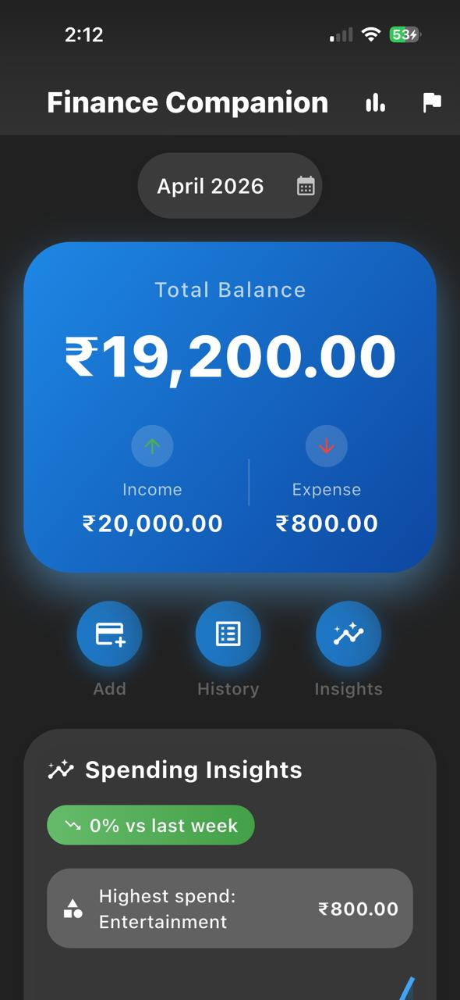
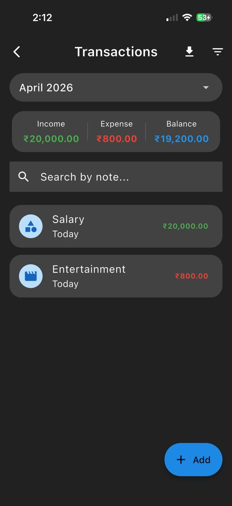
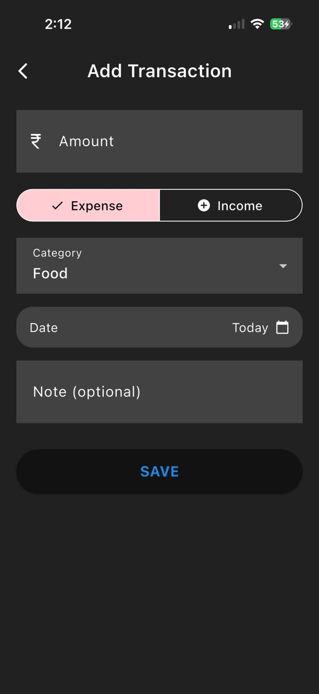
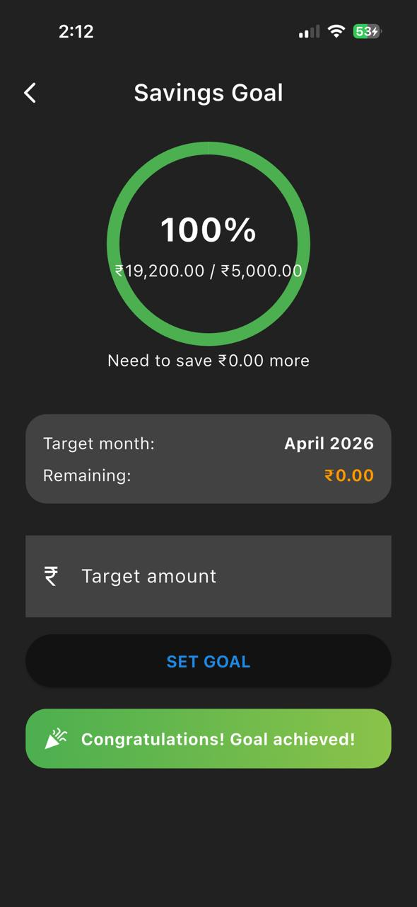
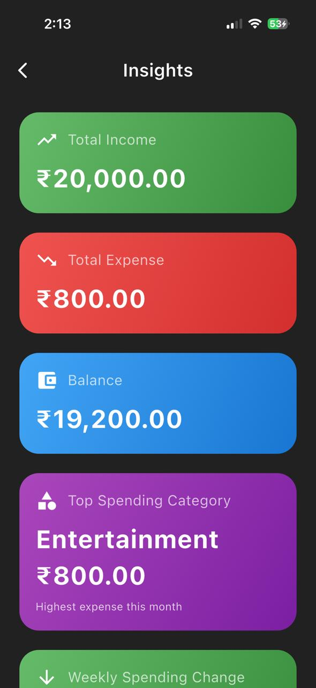

# 💰 Personal Finance Companion – Flutter App

A modern, feature‑rich personal finance tracker built with Flutter.  
Track income/expense, set monthly savings goals, gain insights, and manage transactions – all with a beautiful glassmorphic UI and smooth animations.

---

## 📱 Screenshots

| Dashboard                                | Transactions                                   | Add/Edit Transaction                   |
|------------------------------------------|------------------------------------------------|----------------------------------------|
|  |  |  |

| Goal                           | Insights                               |
|--------------------------------|----------------------------------------|
|  |  |

---

## 🚀 Features

- **Dashboard** – monthly balance, income/expense, recent transactions, spending insights & sparkline chart.
- **Transaction Management** – full CRUD with search, filter by type, swipe to delete.
- **CSV Export** – Export any month's transactions to a CSV file for backup or external analysis.
- **Monthly Savings Goal** – set target, track progress with circular ring, real‑time update using actual savings.
- **Insights Screen** – total income/expense, top spending category, weekly spending change, smart tips.
- **Month‑wise Data** – select any month to view its transactions and statistics (both on dashboard and transactions screen).
- **Modern UI** – glassmorphic app bar, gradient cards, haptic feedback, dark mode support, smooth animations.
- **Local Persistence** – all data stored locally using Hive (NoSQL) – no internet required.

---

## 🏗️ Architecture & Tech Stack

| Technology | Purpose | Why chosen |
|------------|---------|-------------|
| **Flutter 3.x** | Cross‑platform framework | Single codebase for Android & iOS, fast development, great UI capabilities |
| **Riverpod 2.x** | State management | Reactive, testable, minimal boilerplate, avoids `setState` spaghetti |
| **Hive** | Local database | No SQL, fast, type‑safe, perfect for offline‑first finance data |
| **fl_chart** | Charts & graphs | Beautiful, customisable, supports bar/line/pie charts |
| **intl** | Date & currency formatting | Standard Dart package, handles localisation |
| **share_plus** | CSV export & Sharing | Simple sharing of exported transaction data |
| **flutter_native_splash** | Splash screen | Professional app launch experience |

### 📁 Project Structure
```text
lib/
├── main.dart
├── app/
│   ├── routes.dart
│   └── theme.dart
├── data/
│   ├── models/
│   │   ├── transaction.dart
│   │   └── goal.dart
│   ├── repositories/
│   │   └── finance_repository.dart
│   └── boxes/
├── providers/
│   ├── transaction_provider.dart
│   ├── goal_provider.dart
│   └── insights_provider.dart
├── screens/
│   ├── dashboard_screen.dart
│   ├── transaction_list_screen.dart
│   ├── add_edit_transaction_screen.dart
│   ├── goal_screen.dart
│   └── insights_screen.dart
├── widgets/
│   ├── balance_card.dart
│   ├── spending_chart.dart
│   ├── goal_progress_ring.dart
│   ├── transaction_tile.dart
│   └── empty_state.dart
└── utils/
    ├── formatters.dart
    ├── constants.dart
    └── csv_exporter.dart
```

**Why this structure?**  
Separation of concerns – UI, business logic, data access are decoupled. Easy to test, maintain, and scale.

---

## 🛠️ Setup & Run

### Prerequisites
- Flutter SDK (≥3.10)  
- Dart (≥3.0)  
- Android Studio / VS Code

### Steps

1. **Clone the repository**
   ```bash
   git clone https://github.com/yourusername/finance_companion.git
   cd finance_companion
   ```

2. **Get dependencies**
   ```bash
   flutter pub get
   ```

3. **Generate Hive adapters**
   ```bash
   flutter pub run build_runner build --delete-conflicting-outputs
   ```

4. **Run the app**
   ```bash
   flutter run
   ```

*For iOS, you may need to run `cd ios && pod install && cd ..`*

---

## 🎯 Approach & Design Decisions

1. **Local‑first, offline capable**
   - All transactions and goals are stored in Hive boxes.
   - No backend required – user data never leaves the device.
   - **Benefit:** Privacy, speed, works without internet.

2. **Month‑wise data separation**
   - User can pick any month from dropdown.
   - Dashboard and transactions screen show data only for selected month.
   - **Why?** Real finance tracking happens per month (budgeting, salary cycles). Makes the app more practical.

3. **Goal integration with actual savings**
   - Goal progress = (total income – total expense) / target amount.
   - Not a separate dummy feature – uses real transaction data.
   - **Benefit:** User sees genuine progress, no extra input.

4. **CSV Export Implementation**
   - Uses `csv` package for data formatting and `share_plus` for native sharing.
   - Allows users to export specific month data directly from the Transactions screen.
   - **Benefit:** Data portability and backup without needing cloud sync.

5. **Riverpod for state management**
   - StateNotifier + Provider – reactive updates.
   - All filters (month, search, type) are applied through the same provider.
   - **Benefit:** UI always reflects current state without manual refreshes.

6. **Glassmorphic UI + Haptics**
   - BackdropFilter for blur, gradients, shadows, rounded corners.
   - HapticFeedback on taps – subtle vibration improves UX.
   - **Benefit:** Premium look & feel, competitive with modern fintech apps.

7. **Custom page transitions**
   - Fade + slide animations (0.3 seconds) between screens.
   - **Why?** Avoids abrupt changes, makes navigation feel fluid.

---

## ✅ Pros (Strengths)

| Area | Advantage |
|------|-----------|
| **Performance** | Hive is extremely fast – no SQL overhead. |
| **Data Portability** | Native CSV export for all transactions. |
| **User Experience** | Bouncy scroll, swipe to delete, snackbar feedback, empty states. |
| **Offline first** | Works completely offline – no API dependency. |
| **Code quality** | Clean architecture, reusable widgets, typed providers. |
| **Customisation** | Dark mode follows system, easy to add themes. |
| **Scalability** | Adding new features (e.g., budgets, recurring transactions) is straightforward. |

---

## ❌ Cons (Trade‑offs)

| Area | Limitation | Possible mitigation |
|------|------------|---------------------|
| **No multi‑device sync** | Data is local only – cannot share across devices. | Add Firebase / REST API later. |
| **No cloud backup** | User loses data if app is uninstalled. | CSV export exists; Cloud backup planned. |
| **No biometric lock** | Anyone with phone access can see finances. | Can add `local_auth` package. |
| **No notifications** | No reminders to log expenses. | Add `flutter_local_notifications`. |
| **Basic insights** | Only weekly change & top category. | Could add more charts (pie, monthly trend). |

---

## 🔮 Future Improvements
- **Recurring transactions** – monthly salary, rent.
- **Budget limits** – per‑category spending alerts.
- **Biometric unlock** – fingerprint / Face ID.
- **Push notifications** – daily reminders.
- **Pie chart** for category breakdown.
- **Backup & restore** – cloud or local file.

---

## 📄 License
This project is for assignment submission only. All rights reserved.

---

## 👨‍💻 Author
Developed as part of Mobile App Developer Intern assignment for Zorvyn FinTech Pvt. Ltd.

**⏱️ Time Spent:** ~10 hours (planning, coding, UI polishing, documentation).

---

## 🧠 Key Learnings
- Implementing Hive with enums (`TransactionTypeAdapter`).
- Using Riverpod for complex filters (month + search + type).
- Creating glassmorphic UI with `BackdropFilter`.
- Managing month‑wise data without separate database tables.
- Haptic feedback for better UX.

---

## 🙌 Acknowledgements
- Flutter team for the amazing framework.
- Riverpod, Hive, fl_chart package maintainers.
